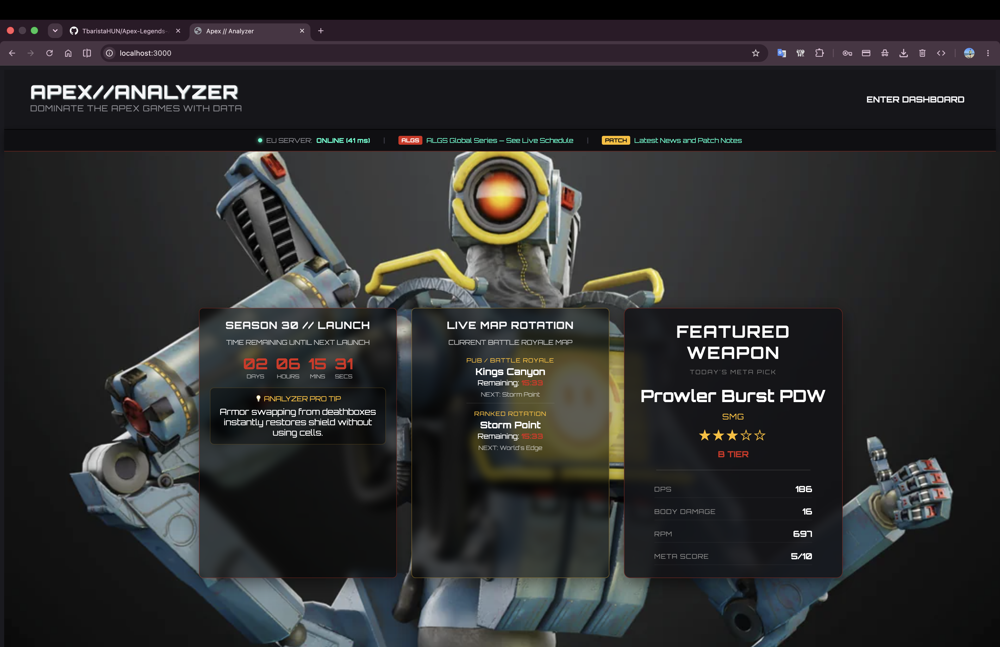
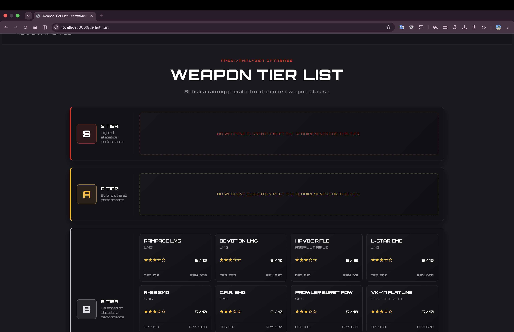
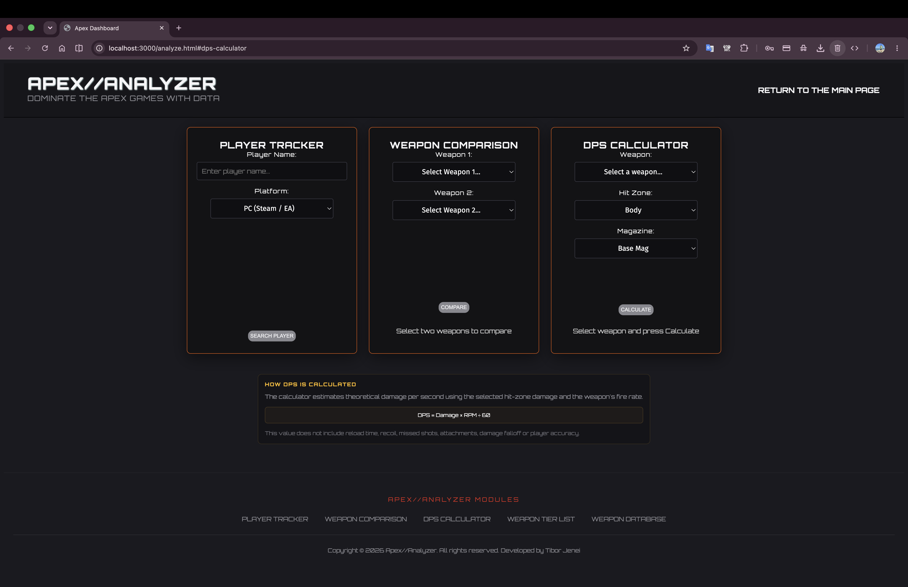
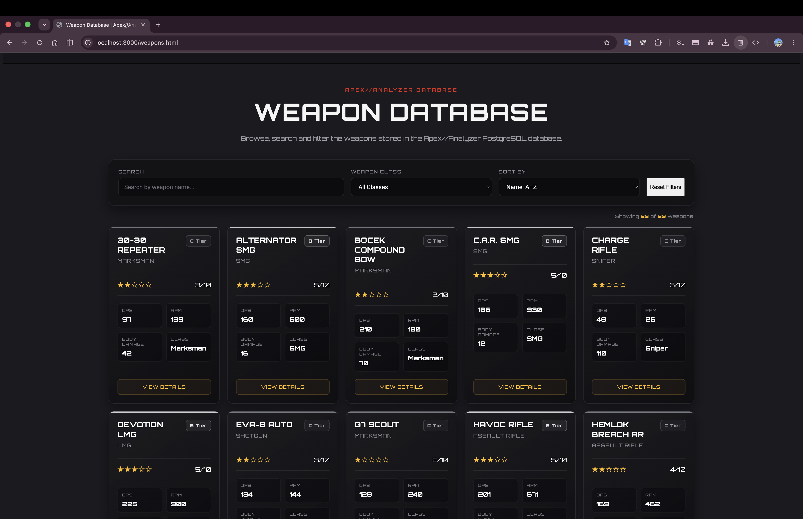

Apex//Analyzer

A full-stack web application developed as part of my Computer Engineering Bsc. thesis.

The project provides real-time Apex Legends statistics, advanced weapon analysis, DPS calculations, player tracking, weapon comparisons and a searchable weapon database. It demonstrates the design and implementation of a modern three-tier web application using REST APIs, PostgreSQL and JavaScript. 

Features:

Live Player Tracker
- Search Apex Legends players by username and platform
- Display player level, rank and current legend
- Retrieve real-time data through the Apex Legends API

Weapon Comparison
- Compare two weapons side-by-side
- Automatic DPS calculation
- Damage comparison
- RPM comparison
- Visual highlighting of the better weapon

DPS Calculator
- Calculate real-time DPS
- Select hit zone (Head / Body / Legs)
- Magazine level support
- Instant damage calculations

Weapon Database
- Complete searchable weapon database
- Individual weapon detail pages
- Weapon statistics
- Magazine capacities
- Damage profiles
- Weapon classes

Weapon Detail Page
Each weapon contains:

- General statistics
- Meta Score
- Tier Ranking
- Star Rating
- Advantages
- Disadvantages
- Recommended playstyle
- Weapon description

Weapon Tier List
Automatically generated weapon rankings based on statistical performance.

Weapons are classified into:

- S Tier
- A Tier
- B Tier
- C Tier

Featured Weapon
Displays a dynamically selected weapon based on the current Meta Score algorithm.

Technology Stack

Frontend:

- HTML5
- CSS3
- JavaScript (ES6)
- Fetch API

Backend

- Node.js
- Express.js
- REST API
- Axios

Database

- PostgreSQL
- JSONB weapon data
- Parameterized SQL queries

Security

- Environment variables (.env)
- Hidden API keys
- Backend proxy architecture
- SQL Injection protection
- CORS support

 Project Architecture

Browser

↓

Express Backend

↓

PostgreSQL Database

↓

External Apex Legends API

Future Improvements

- Authentication
- Favorite weapons
- User profiles
- Advanced filtering
- Weapon statistics charts
- Historical meta analysis

User Interface Design

The application uses a custom Apex Legends inspired interface design:

- Fully custom responsive layout
- Dark sci-fi themed visual identity
- Custom typography system
- Modular card-based components
- Page-specific CSS architecture
- Responsive design for different screen sizes

Meta Score Algorithm

The Meta Score system evaluates weapons based on multiple statistical factors:

- Damage output
- Rate of fire
- DPS performance
- Weapon class
- Overall combat effectiveness

The calculated score is used for:
- Weapon ranking
- Tier List generation
- Featured Weapon selection

Database Architecture

The project uses a hybrid relational-document database approach.

Relational fields store:
- Weapon identity
- Class
- RPM
- Basic statistics

JSONB fields store:
- Damage profiles
- Magazine levels
- Extended weapon properties

This approach provides flexibility while maintaining PostgreSQL performance.

Application Modules

The application is organized into independent modules:

- Player Tracker
- Weapon Comparison
- DPS Calculator
- Weapon Database
- Weapon Tier List
- Weapon Detail Pages

Live Demo

https://apex-legends-analyzer-1.onrender.com

Developed by

Tibor Jenei

Engineering Informatics BSc Thesis Project

Homepage: 

Weapon-Tier-List: 

DPS-Calculator: 

Weapon-Database: 

------------------------------------------------------------------------------------------------------------------------------------------------------------------------------------------

Hungarian version:

Apex//Analyzer

Az Apex//Analyzer egy teljes értékű háromrétegű webalkalmazás, amelyet Mérnökinformatikus szakos szakdolgozati projektként fejlesztek.

Az alkalmazás valós idejű Apex Legends játékosstatisztikákat, fegyverelemzést, DPS kalkulációt, fegyver-összehasonlítást, valamint egy kereshető fegyveradatbázist biztosít. A projekt célja egy modern REST architektúrára épülő, PostgreSQL adatbázist használó webalkalmazás megtervezése és megvalósítása. 

Fő funkciók

Live Player Tracker

- Apex Legends játékos keresése
- Platform kiválasztása
- Valós idejű játékosadatok
- Szint, rang és fő karakter megjelenítése

Weapon Comparison

- Két fegyver összehasonlítása
- DPS összevetés
- Sebzés összevetés
- RPM összevetés
- A jobb fegyver automatikus kiemelése

DPS Calculator

- Valós idejű DPS számítás
- Head / Body / Leg találati zónák
- Tárméret kiválasztása
- Azonnali sebzés kalkuláció

Weapon Database

- Teljes fegyveradatbázis
- Keresés
- Részletes fegyveroldalak
- Sebzésprofilok
- Tárkapacitások
- Fegyverosztályok

Weapon Detail oldal

Minden fegyver külön oldallal rendelkezik, amely tartalmazza:

- Alapstatisztikák
- Meta Score értékelés
- Tier besorolás
- Csillagos értékelés
- Előnyök
- Hátrányok
- Ajánlott játékstílus
- Részletes leírás

Weapon Tier List

A fegyverek automatikus rangsorolása statisztikai adatok alapján.

Besorolások:

- S Tier
- A Tier
- B Tier
- C Tier

Featured Weapon

Dinamikusan kiválasztott kiemelt fegyver a Meta Score algoritmus alapján.

Technológiák

Frontend

- HTML5
- CSS3
- JavaScript (ES6)
- Fetch API

Backend

- Node.js
- Express.js
- REST API
- Axios

Adatbázis

- PostgreSQL
- JSONB adattípus
- Paraméterezett SQL lekérdezések

 Biztonság

- .env környezeti változók
- API kulcsok védelme
- Backend proxy szerver
- SQL Injection elleni védelem
- CORS kezelés

Rendszerarchitektúra

Böngésző

↓

Express Backend

↓

PostgreSQL adatbázis

↓

Külső Apex Legends API

Továbbfejlesztési lehetőségek

- Felhasználói fiókok
- Kedvenc fegyverek
- Profilkezelés
- Haladó szűrési lehetőségek
- Grafikonok és statisztikák
- Meta változásainak nyomon követése

Felhasználói felület

Az alkalmazás egyedi Apex Legends inspirált kezelőfelülettel rendelkezik:

- Teljesen egyedi reszponzív elrendezés
- Sötét sci-fi tematikájú vizuális megjelenés
- Egyedi tipográfiai rendszer
- Moduláris kártya alapú komponensek
- Oldalspecifikus CSS architektúra
- Különböző kijelzőméretek támogatása

Meta Score algoritmus

A Meta Score rendszer több statisztikai tényező alapján értékeli a fegyvereket:

- Sebzés
- Tűzgyorsaság
- DPS teljesítmény
- Fegyverkategória
- Harci hatékonyság

Az eredmény felhasználása:

- Fegyverranglista
- Tier List generálás
- Kiemelt fegyver kiválasztása

Online verzió

https://apex-legends-analyzer-1.onrender.com

Fejlesztő:

Jenei Tibor

Mérnökinformatikus BSc. hallgató